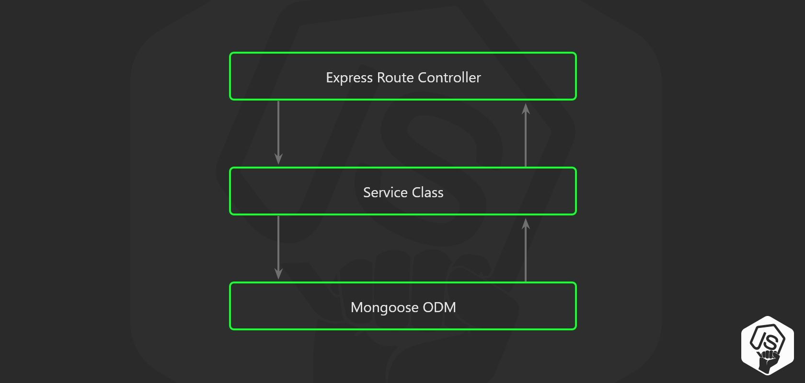

# AutoBeRich Backend

## 구성

[]()
[]()

[]()
[]()
[]()
[]()


## .env
```
MONGO_URL = mongo connection URL
JWT_SECRET = jwt token 암복호화키
UPBIT_ENCRYPT_KEY = upbit access,secret 암복호화키
```

## install
```console
# yarn install
# yarn dev
```

## Structure
```
BE
├── images                          # image files
├── src
│    ├── config       
│    │     ├──  filter               # filtering handler
│    │     └──  properties           # 환경변수
│    ├── controllers                 # controllers
│    ├── errors                      # error generator
│    ├── interfaces                  # obejct interfaces
│    ├── loaders                     # init loaders
│    ├── models                      # db schemas
│    ├── routes                      # express routes
│    ├── services                    # services
│    └── App.ts                      # start service           
├──  .eslintrc.json                  # eslint settings
├──  .prettierrc.json                # prettier settings
├──  Dockerfile                      # docker build file
├──  package.json                     
├──  tsconfig.json                   # tyscript settings
├──  yarn.lock  
    
    
```


## 프로젝트 구조

- 3 계층 구조
  
- 비지니스 로직은 Controller X Service O
- 환경설정 값은 configuration manager를 사용(dotenv)
- node.js 서버 설정파일을 작은 모듈들로 분리하여 독립적으로 로드


## 참고 블로그
**[프로젝트 구조](https://velog.io/@hopsprings2/%EA%B2%AC%EA%B3%A0%ED%95%9C-node.js-%ED%94%84%EB%A1%9C%EC%A0%9D%ED%8A%B8-%EC%95%84%ED%82%A4%ED%85%8D%EC%B3%90-%EC%84%A4%EA%B3%84%ED%95%98%EA%B8%B0#pubsub-%EA%B3%84%EC%B8%B5%EB%8F%84-%EC%82%AC%EC%9A%A9%ED%95%98%EC%8B%AD%EC%8B%9C%EC%98%A4-%EF%B8%8F)**
**[crypto-js 공식문서](https://www.npmjs.com/package/crypto-js)**
**[node-upbit 공식문서](https://www.npmjs.com/package/node-upbit)**
**[express-validator](https://www.npmjs.com/package/express-validator)**

