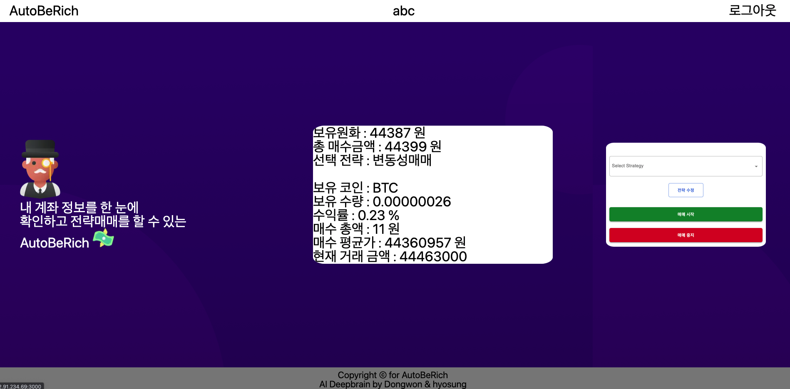

# AutoBeRich (자동으로 부자되기)

Website[http://52.91.234.69:3000/]



## 개발 기간

22.1.11 ~ 22.1.25

## 내용

코인 자동매수매매 프로그램.
원하는 전략(현재는 변동성 매매 전략만 구현)으로 코인 자동매수매매를 선택하여 24시간 작동을 하고 내가 자는 동안에도 돈을 벌어다 줘서 나를 부자로 만들어줄 서비스.

## Tech Stack

### FE


[]()
[]()

[]()
[]()
[]()


### BE

[]()
[]()

[]()
[]()
[]()
[]()

## Install & Execute

### FE/.env

```
NEXT_PUBLIC_API_URL # server end point
```

### BE/.env

```
MONGO_URL # mongo connection URL
JWT_SECRET # jwt token encrypt_key
UPBIT_ENCRYPT_KEY # upbit access,secret 암복호화키
```

## `DEV mode Scripts`

### FE

dev 개발시

```
yarn install 후 yarn dev
```

aws 배포시

```
yarn build(next build) 후 yarn start (next start)
```

### BE

```
`yarn install` 이후 `yarn dev`
```

<br/>

## `Structure`

### FE

```
.
├── README.md
├── next.config.js
├── node_modules
├── package-lock.json
├── package.json
├── public
├── components # 컴포넌트 작성후 pages에서 렌더링, 페이지 단위 컴포넌트
│ ├── panners
│ │ ├── Intro.tsx
│ │ ├── MyAccount.tsx # 계좌조회 뷰
│ │ ├── MyAccountContainer.tsx # 계좌조회 로직
│ │ ├── SelectStrategy.tsx # 트레이딩 전략 선택 뷰
│ │ └── SelectStrategyContainer.tsx # 트레이딩 전략 선택 로직
│ ├── Contents.tsx
│ ├── Footer.tsx
│ ├── HomePage.tsx
│ └── TopBar.tsx
├── styles # global style정의, 그외 컴포넌트 style은 각 컴포넌트에서 정의
│ ├── global-style.ts
│ ├── globals.css
│ ├── Home.module.css
│ └── theme.ts
├── apis # 각 api 호출 모듈
├── pages # auto routing 되는 페이지 작성
│ ├── login
│ │ ├── loginPresenter.ts # view 관련 로직
│ │ ├── loginContainer.ts # 비즈니스 로직 관련
│ │ └── index.ts
│ ├── register
│ │ ├── registerPresenter.ts # view 관련 로직
│ │ ├── registerContainer.ts # 비즈니스 로직 관련
│ │ └── index.ts
│ ├── _app.tsx # 메인 페이지 호출
│ ├── _document.tsx # ssr 구동
│ ├── index.tsx # 첫 구동 페이지
├── store # redux store
│ ├── reducers
│ │ ├── userInfo.ts # (리듀서 모듈)
│ │ └── index.ts # (리듀서 모듈 통합)
│ ├── hooks.ts # (redux-tookkit hooks)
│ └── index.js # (store 생성 && wrapper 생성)
└── styles
```

### BE

```
├── images                          # image files
├── src
│    ├── config
│    │     ├──  filter               # filtering handler
│    │     └──  properties           # 환경변수
│    ├── controllers                 # controllers
│    ├── errors                      # error generator
│    ├── interfaces                  # obejct interfaces
│    ├── loaders                     # init loaders
│    ├── models                      # db schemas
│    ├── routes                      # express routes
│    ├── services                    # services
│    └── App.ts                      # start service
├──  .eslintrc.json                  # eslint settings
├──  .prettierrc.json                # prettier settings
├──  Dockerfile                      # docker build file
├──  package.json
├──  tsconfig.json                   # tyscript settings
├──  yarn.lock
```

## Richs

### 김동원

좋은 팀원을 만나 하고 싶은 프로젝트를 2주간 즐겁게 구현하였습니다. 너무 행복한 2주였어요.

이 서비스는 점점 더 발전해 나갈겁니다 화이팅!

### 배효성

조만간 부자 될것 같습니다 저에게 잘보이세요 ㅎㅎ

### 김민지(동원 부캐 아이디)

저는 동원오빠 동생입니다. 학생 계정을 이용하려는 오빠의 도용을 하다가 그 이후부터 커밋이 다 제이름으로 들어갔어요. 저는 코드 한줄 안짰습니다. 제가 쓴 코드는 다 오빠가 쓴 코드에요

## 참고 문헌

**[조코딩-전략](https://www.youtube.com/watch?v=WgXOFtDD6XU&t=167s)**
**[프로젝트 구조](https://velog.io/@hopsprings2/%EA%B2%AC%EA%B3%A0%ED%95%9C-node.js-%ED%94%84%EB%A1%9C%EC%A0%9D%ED%8A%B8-%EC%95%84%ED%82%A4%ED%85%8D%EC%B3%90-%EC%84%A4%EA%B3%84%ED%95%98%EA%B8%B0#pubsub-%EA%B3%84%EC%B8%B5%EB%8F%84-%EC%82%AC%EC%9A%A9%ED%95%98%EC%8B%AD%EC%8B%9C%EC%98%A4-%EF%B8%8F)**
**[crypto-js 공식문서](https://www.npmjs.com/package/crypto-js)**
**[node-upbit 공식문서](https://www.npmjs.com/package/node-upbit)**
**[express-validator](https://www.npmjs.com/package/express-validator)**
**[우아한 테크캠프 4기 ET 프로젝트](https://github.com/woowa-techcamp-2021/store-7)**
